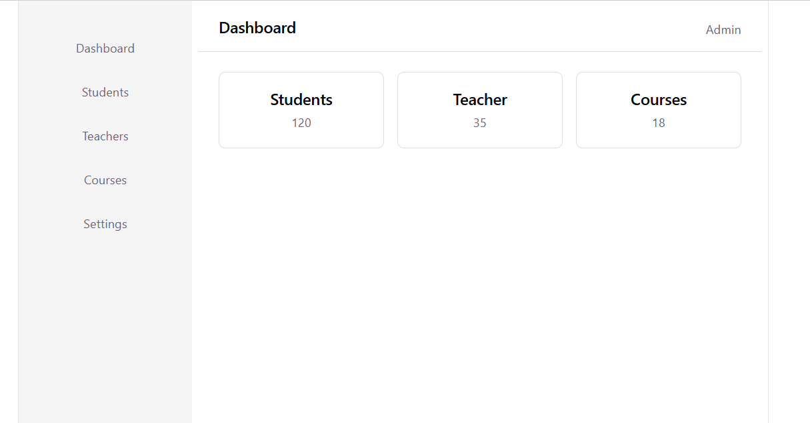

# Dashboard UI

A responsive dashboard interface built with React and TypeScript.

## Features

- Responsive sidebar navigation
- Dashboard navbar
- Reusable dashboard cards
- Props-based dynamic data
- Responsive layout for mobile and desktop
- Clean component-based folder structure

## Technologies

- React
- TypeScript
- Vite
- CSS
- Flexbox
- Git & GitHub

## Project Structure

src/
├── components/
│   ├── cards/
│   │   └── DashboardCard.tsx
│   └── layout/
│       ├── Navbar.tsx
│       └── Sidebar.tsx
├── pages/
│   └── Dashboard.tsx
├── App.tsx
├── App.css
└── main.tsx

## Getting Started

### Install dependencies

npm install

### Run the development server

npm run dev

## Project Preview

## Project Preview

## GitHub

https://github.com/saadiarehman/dashboard-ui-react
